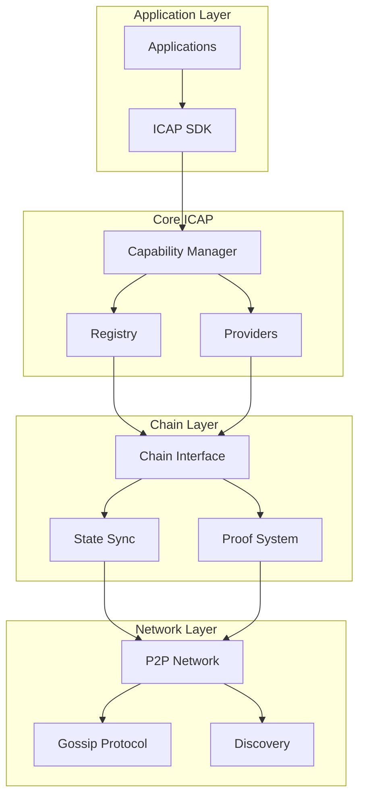
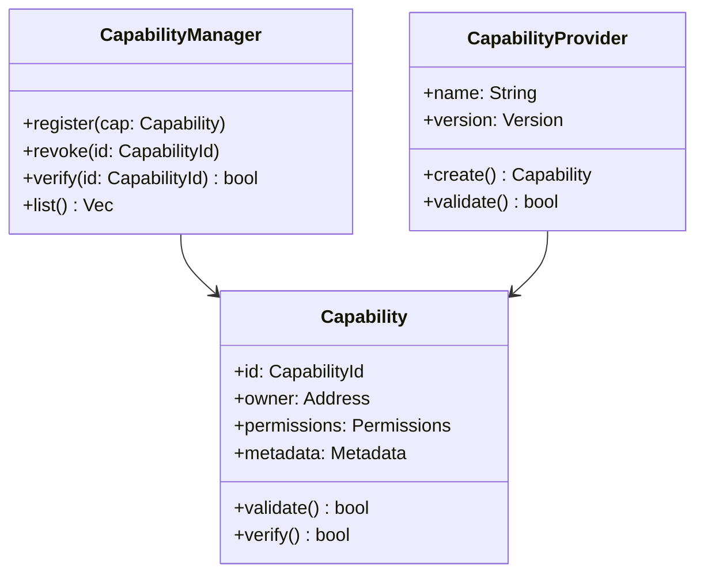
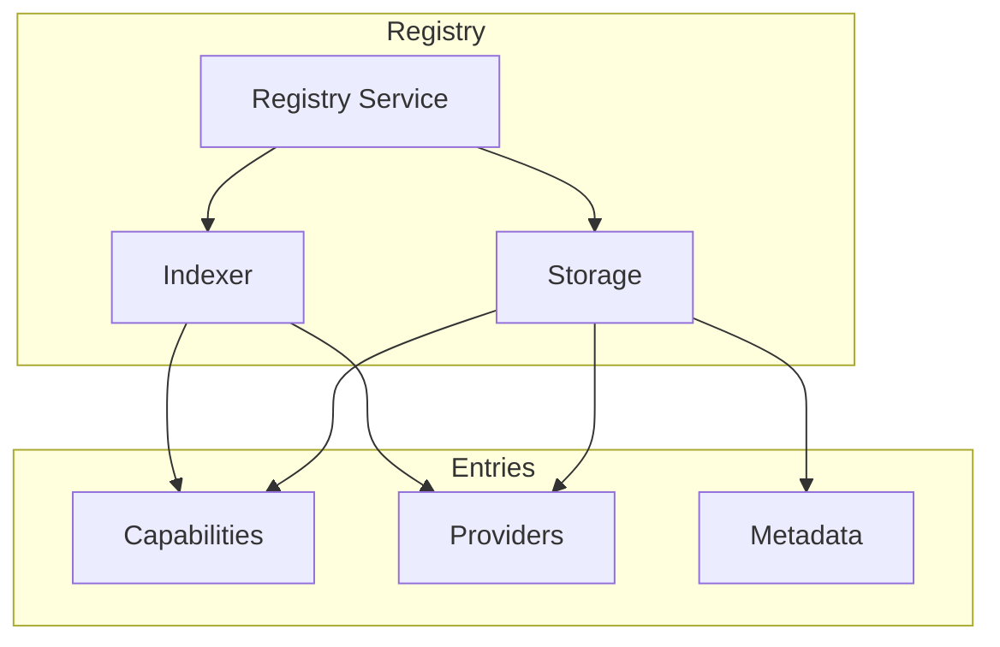
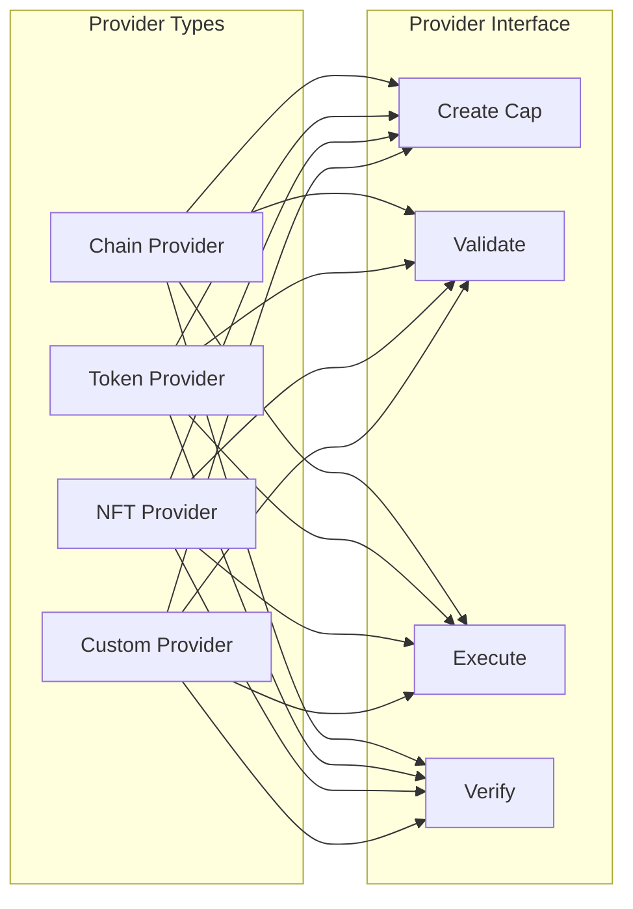
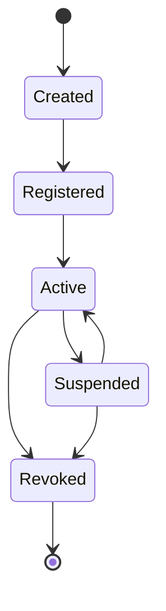
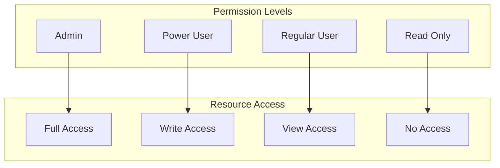
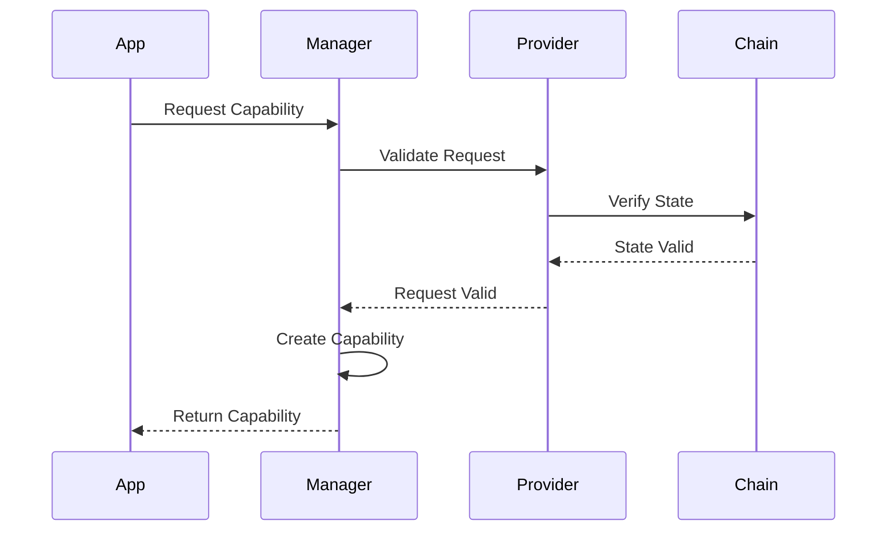
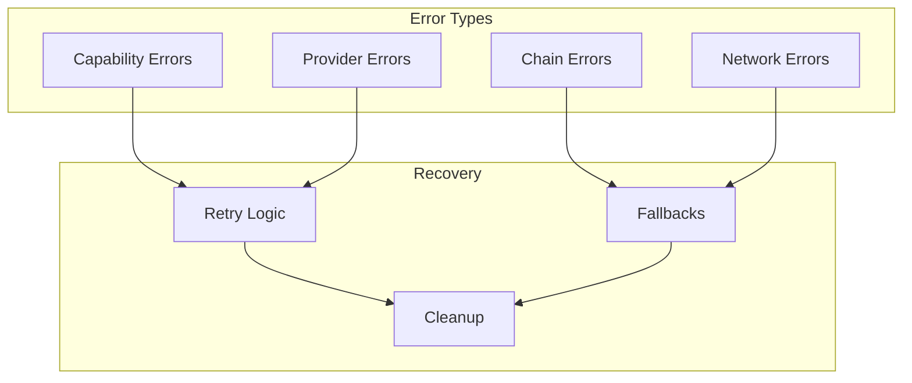

# Frostgate ICAP Design

This document describes the current design of Frostgate's Interchain Capability (ICAP) system.

## Architecture Overview



## Core Components

### 1. Capability System



### 2. Registry System



### 3. Provider System



## Data Structures

### 1. Capability Format

```rust
struct Capability {
    id: CapabilityId,
    owner: Address,
    provider: ProviderId,
    permissions: Vec<Permission>,
    metadata: Metadata,
    expiration: Option<Timestamp>,
    signature: Signature,
}

struct Permission {
    action: Action,
    resource: Resource,
    constraints: Vec<Constraint>,
}

struct Metadata {
    name: String,
    description: String,
    created_at: Timestamp,
    updated_at: Timestamp,
    custom: HashMap<String, Value>,
}
```

### 2. Provider Format

```rust
struct Provider {
    id: ProviderId,
    name: String,
    version: Version,
    supported_actions: Vec<Action>,
    supported_resources: Vec<Resource>,
    config: ProviderConfig,
}

struct ProviderConfig {
    max_capabilities: u32,
    default_expiration: Duration,
    require_verification: bool,
    custom: HashMap<String, Value>,
}
```

## State Management



## Security Model

### 1. Permission System



### 2. Verification Flow



## Performance Optimizations

1. Caching System
   - In-memory capability cache
   - Provider result caching
   - Chain state caching

2. Batch Operations
   - Bulk capability registration
   - Batch verification
   - State sync optimization

3. Async Processing
   - Non-blocking verification
   - Parallel provider execution
   - Background state sync

## Error Handling



## Future Extensions

1. Enhanced Provider Types
   - Smart contract capabilities
   - Cross-chain messaging
   - Oracle integration

2. Advanced Security Features
   - Capability delegation
   - Multi-signature support
   - Timelock mechanisms

3. Performance Features
   - Sharded capability storage
   - Optimistic verification
   - State compression

4. Integration Features
   - External provider SDK
   - Chain adapter framework
   - Custom verification hooks 