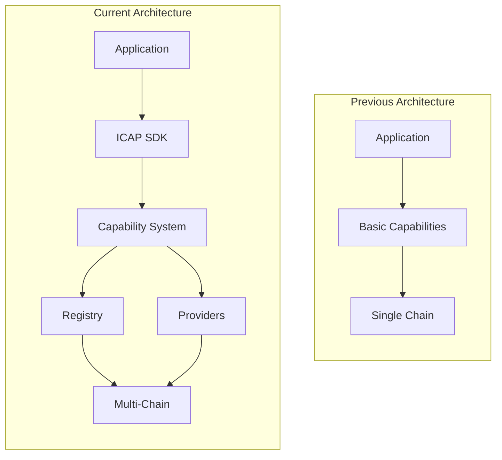
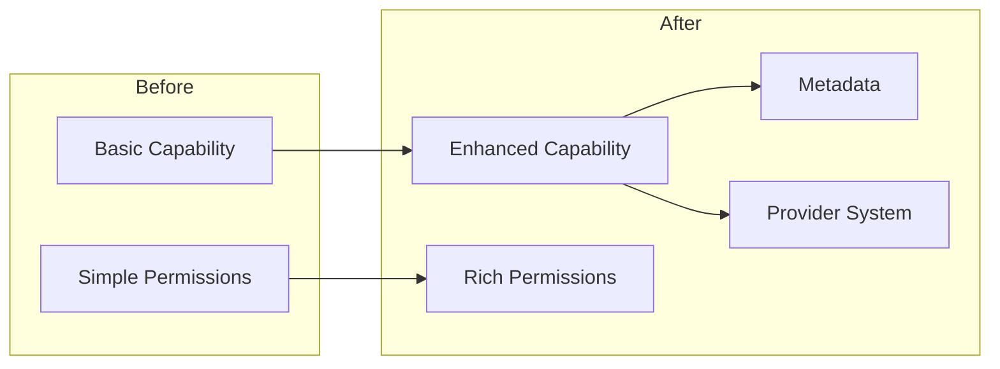
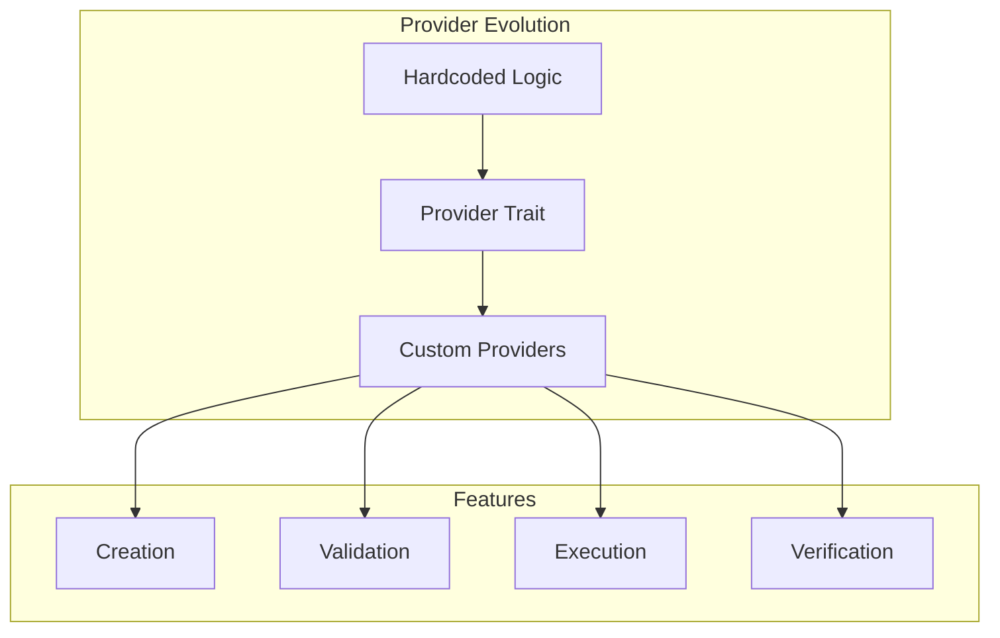
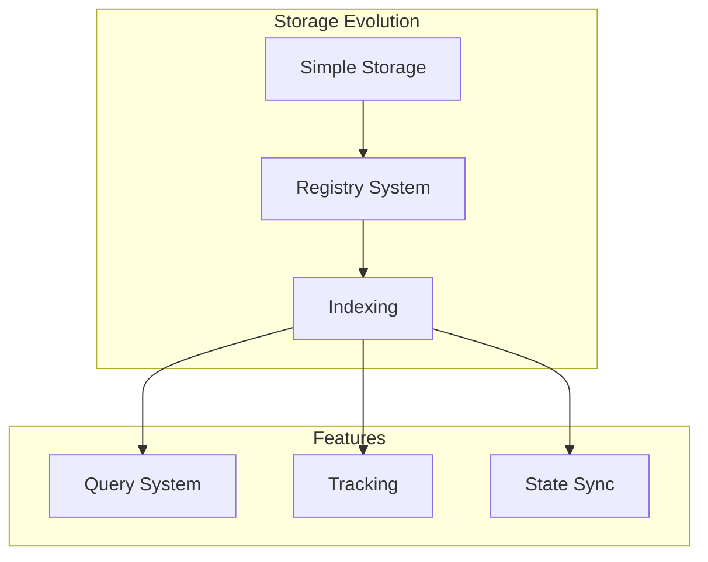
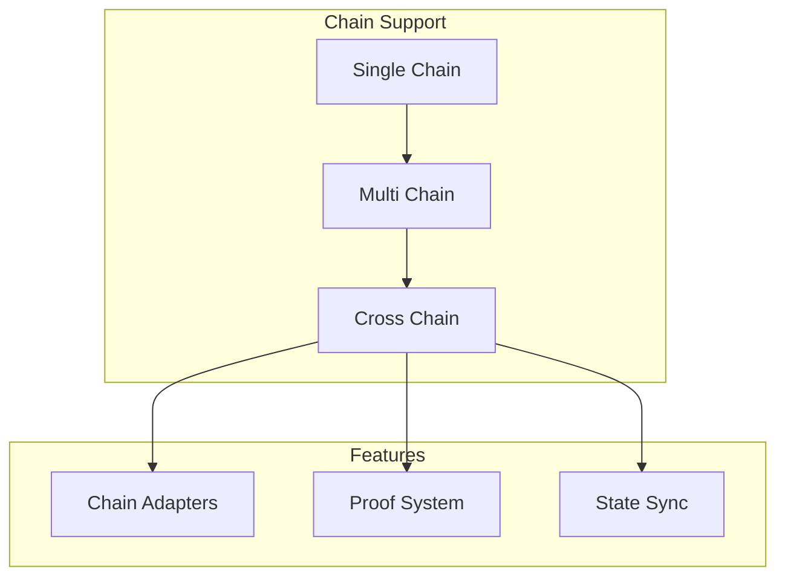
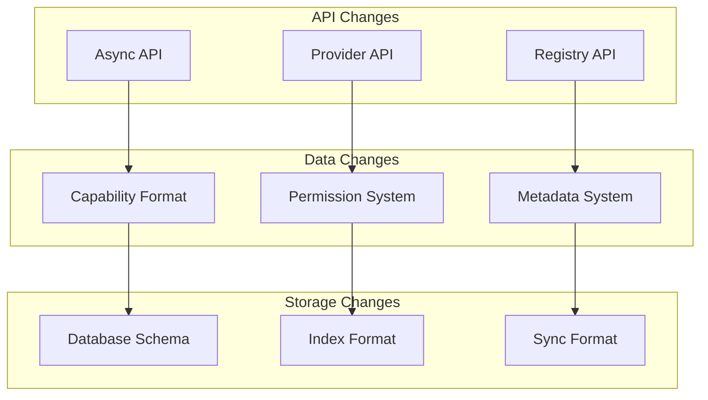
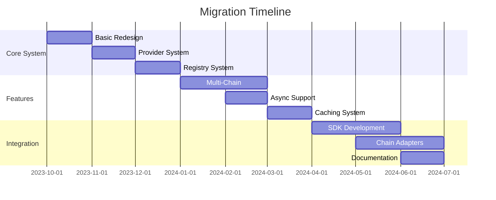

# Frostgate ICAP Migration Guide

This document outlines the migration path from the previous ICAP architecture to the current design, highlighting key changes and improvements.

## Architecture Evolution



## Previous Architecture Limitations

1. Single Chain Focus
   - Limited to one blockchain
   - No cross-chain capabilities
   - Tight coupling to chain specifics

2. Basic Capability Model
   - Simple permission system
   - No provider abstraction
   - Limited metadata support

3. Performance Issues
   - Synchronous operations
   - No caching system
   - Limited scalability

4. Limited Extensibility
   - Hard-coded providers
   - Fixed capability types
   - No plugin system

## Migration Steps

### 1. Core System Redesign



#### Before:
```rust
struct Capability {
    id: u64,
    permissions: u32,
    owner: Address,
}
```

#### After:
```rust
struct Capability {
    id: CapabilityId,
    owner: Address,
    provider: ProviderId,
    permissions: Vec<Permission>,
    metadata: Metadata,
    expiration: Option<Timestamp>,
    signature: Signature,
}
```

### 2. Provider System Implementation



#### Before:
```rust
fn verify_permission(cap_id: u64, action: Action) -> bool {
    // Hardcoded verification
}
```

#### After:
```rust
trait CapabilityProvider {
    fn create(&self, params: ProviderParams) -> Result<Capability>;
    fn validate(&self, cap: &Capability) -> bool;
    fn execute(&self, cap: &Capability, action: Action) -> Result<()>;
    fn verify(&self, cap: &Capability) -> bool;
}
```

### 3. Registry Implementation



### 4. Multi-Chain Support



## Breaking Changes



## Migration Benefits

1. Enhanced Capabilities
   - Rich permission model
   - Extensible metadata
   - Provider-based validation

2. Improved Performance
   - Async operations
   - Efficient caching
   - Parallel processing

3. Better Scalability
   - Multi-chain support
   - Sharded storage
   - Optimized sync

4. Enhanced Security
   - Provider-based verification
   - Signature validation
   - Expiration support

## Migration Timeline



## Migration Steps

1. Preparation
   - Audit existing capabilities
   - Plan data migration
   - Update dependencies

2. Core Migration
   - Implement new capability system
   - Add provider framework
   - Setup registry

3. Feature Migration
   - Add multi-chain support
   - Implement async operations
   - Setup caching

4. Integration
   - Update client applications
   - Migrate existing data
   - Update documentation

## Backward Compatibility

1. Compatibility Layer
   - Legacy API support
   - Data format conversion
   - Automatic upgrades

2. Migration Tools
   - Capability converter
   - Data migrator
   - Verification tools

## Testing Strategy

1. Unit Tests
   - Core components
   - Provider system
   - Registry operations

2. Integration Tests
   - Multi-chain operations
   - Async functionality
   - Caching system

3. Migration Tests
   - Data conversion
   - API compatibility
   - Performance validation 